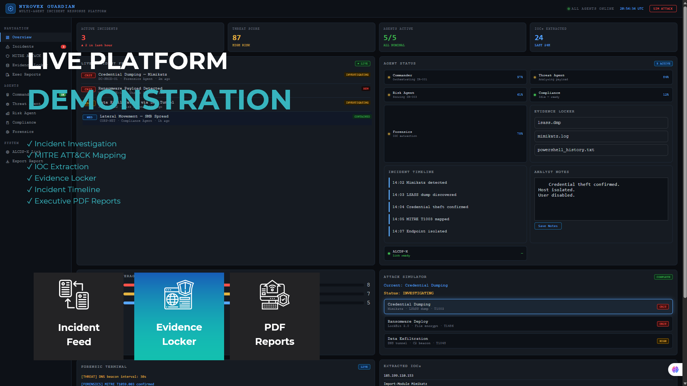
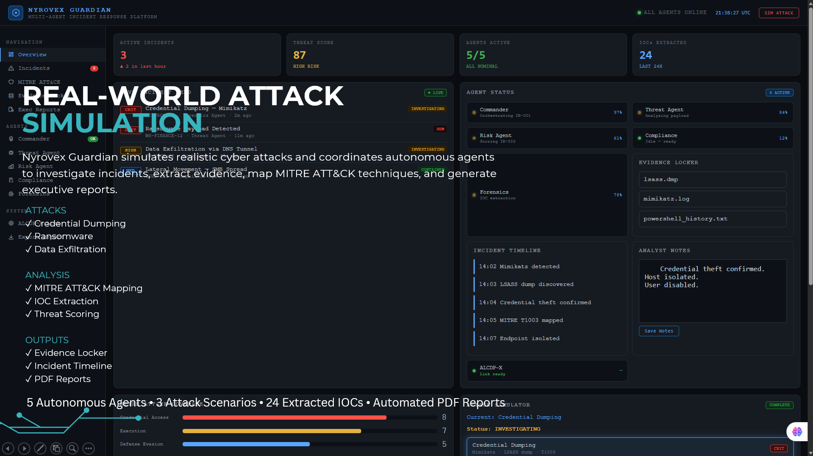
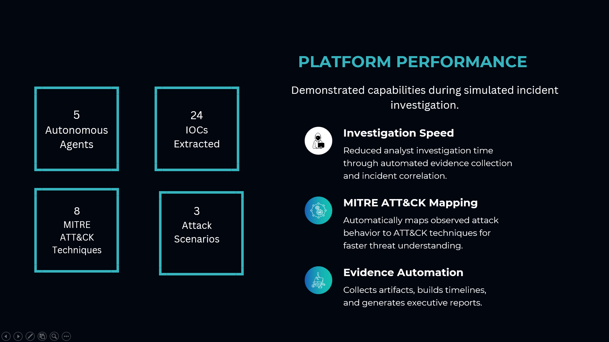

# 🛡️ Nyrovex Guardian

**Autonomous Cyber Investigation & Response Platform**

Nyrovex Guardian is a multi-agent cybersecurity platform that simulates cyber attacks and automates incident investigations through autonomous security agents.

The platform performs:

* Incident Investigation
* IOC Extraction
* MITRE ATT&CK Mapping
* Evidence Collection
* Incident Timeline Generation
* Executive PDF Reporting

---

# 🚀 Features

## Attack Simulation

* Credential Dumping
* Ransomware Activity
* Data Exfiltration

## Investigation Engine

* Threat Scoring
* IOC Extraction
* MITRE ATT&CK Mapping
* Incident Correlation

## Evidence Management

* Evidence Locker
* Analyst Notes
* Incident Timeline

## Reporting

* Executive Reports
* Investigation Summaries
* PDF Export

---

# 🤖 Multi-Agent Architecture

| Agent            | Function                          |
| ---------------- | --------------------------------- |
| Commander Agent  | Investigation orchestration       |
| Threat Agent     | Threat analysis and MITRE mapping |
| Forensics Agent  | Evidence collection               |
| Compliance Agent | Governance validation             |
| Risk Agent       | Risk assessment and scoring       |

## System Architecture

```text
Attack Simulation
        │
        ▼
Investigation Engine
        │
 ┌──────┼──────┐
 ▼      ▼      ▼
Threat  Risk  Compliance
Agent   Agent  Agent
        │
        ▼
Forensics Agent
        │
        ▼
Evidence Locker
        │
        ▼
MITRE ATT&CK Mapping
        │
        ▼
Executive Reports
---

## System Architecture

```text
Attack Simulation
        │
        ▼
Investigation Engine
        │
 ┌──────┼──────┐
 ▼      ▼      ▼
Threat  Risk  Compliance
Agent   Agent  Agent
        │
        ▼
Forensics Agent
        │
        ▼
Evidence Locker
        │
        ▼
MITRE ATT&CK Mapping
        │
        ▼
Executive Reports
```

---

# 📊 Platform Metrics

* 5 Autonomous Agents
* 24 IOCs Extracted
* 8 MITRE ATT&CK Techniques
* 3 Attack Scenarios

---

## Screenshots

### Dashboard Overview



### Incident Investigation



### Platform Performance



---
# 🛠️ Technology Stack

### Frontend

* React
* TypeScript
* Tailwind CSS

### Backend

* Python
* FastAPI

### Security Components

* MITRE ATT&CK Framework
* IOC Analysis
* Threat Scoring
* Incident Response Workflows

---

# 📈 Future Roadmap

## Phase 1 — SOC Investigation

* IOC Extraction
* MITRE Mapping
* Evidence Collection

## Phase 2 — Autonomous Response

* Threat Hunting
* Alert Prioritization
* Containment Actions

## Phase 3 — Enterprise Platform

* RBAC
* Compliance Automation
* Cloud Deployment

## Phase 4 — AI Security Operations

* Autonomous Agents
* Predictive Detection
* Self-Healing Defense

---

# 👨‍💻 Author

**Hrudyansh Kayastha**

GitHub:
https://github.com/hrudyanshkayastha

LinkedIn:
https://www.linkedin.com/in/hrudyansh-kayastha-817853334

---

### Investigate Faster • Respond Smarter • Secure Better

